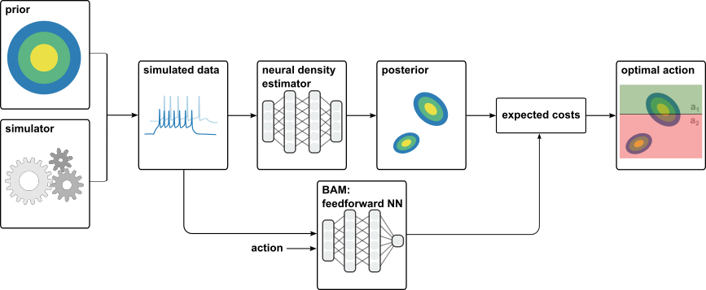
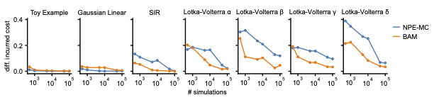

# Amortized Bayesian Decision Making for Simulation-based Models

This repository provides the implementation used for the paper  [Amortized Bayesian Decision Making for simulation-based models](https://arxiv.org/abs/2312.02674). For the full git commit history with correct time stamps, see the branch `paper`.




In this work we address the question of how to perform Bayesian decision making on stochastic simulators, and how one can circumvent the need to compute an explicit approximation to the posterior.
We propose two methods to obtain amortized Bayesian decisions:

(1) **NPE-MC** uses the parametric posterior returned by neural posterior estimation (NPE, see [sbi](https://github.com/sbi-dev/sbi)) and computes the expected cost of decisions by Monte Carlo sampling from the posterior approximation (NPE-MC).

(2) **BAM** circumvents the need to learn the (potentially high-dimensional) posterior distribution explicitly and instead only requires to train a feedforward neural network which is trained to directly predict the expected costs for any data and action. 


## Installation

To install, clone the project and run

```setup
pip install . 
```
Dependencies are listed in `pyproject.toml` and will be installed automatically when installing the package.

## Data generation

Both methods use a dataset that is generated in the following way: 
1. sample parameters from the prior, $\theta\sim p(\theta)$
2. simulate $\theta$ to obtain observations, $x\sim p(x|\theta)$

In order to generate a dataset of (parameter, data) pairs for training BAM or NPE-MC, run for example
```setup
python generate_data.py --task toy_example --type continuous --ntrain 500 --ntest 500
```

During the training of BAM, a third step is performed in every epoch:

3. sample actions $a\sim p(a)$  and compute the ground truth costs $c(\theta, a)$ for every (parameter, data) pair

This way, we can train a feedforward network to regress onto the expected costs of taking action $a$ when $x$ is observed. 

## Training BAM and NPE

To train BAM, run for example:
```train bam
python train_nn.py task.name=toy_example action=continuous seed=0

```

To train NPE, run for example:
```train npe
python train_npe.py task.name=toy_example action=continuous model=npe seed=0
```

## Results

We systematically evaluate the performance of NPE-MC and BAM on four tasks where the ground truth posterior is available. We used a synthesized toy example introduced in the paper and three previously published simulators with ground truth posteriors (see [Simulation-Based Inference Benchmark](https://github.com/sbi-benchmark/sbibm)).




We demonstrate that BAM can largely improve accuracy over NPE-MC on challenging benchmark tasks that both methods can infer decisions for the Bayesian Virtual Epileptic Patient. 

